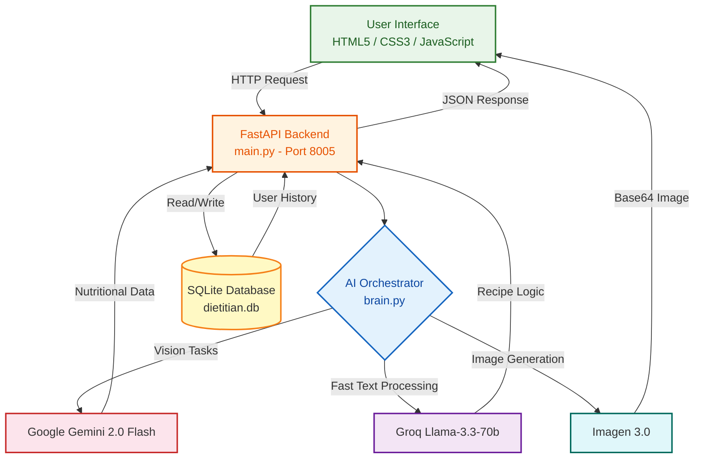
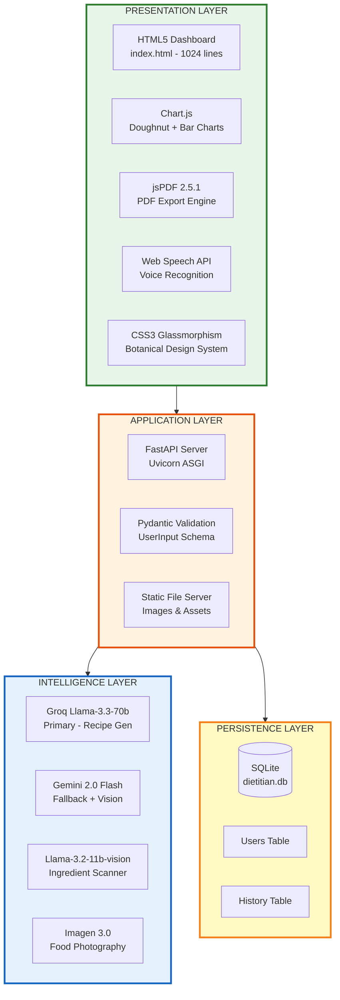
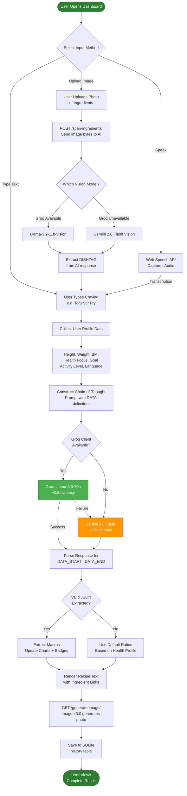
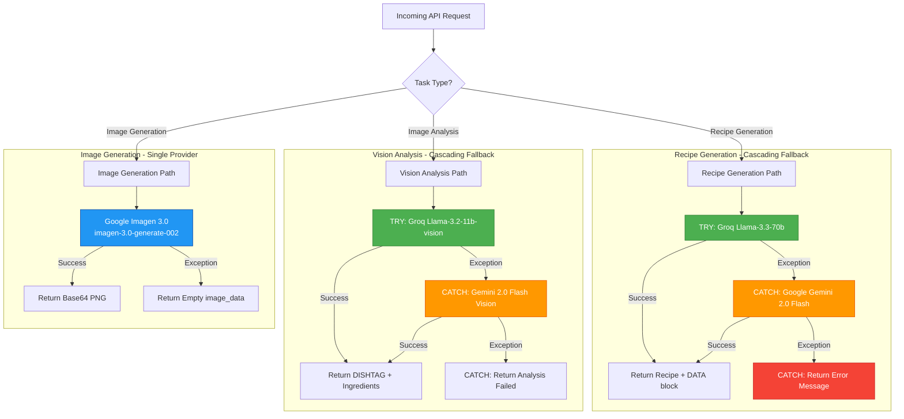
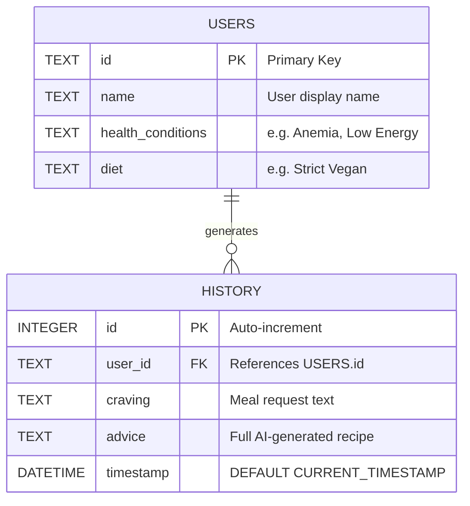
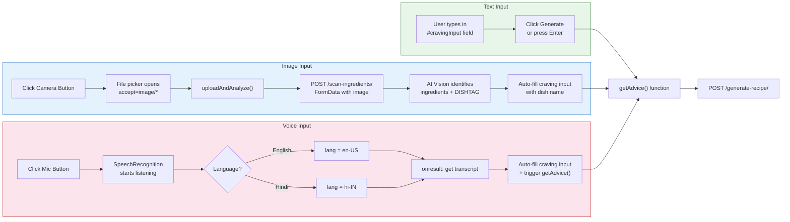
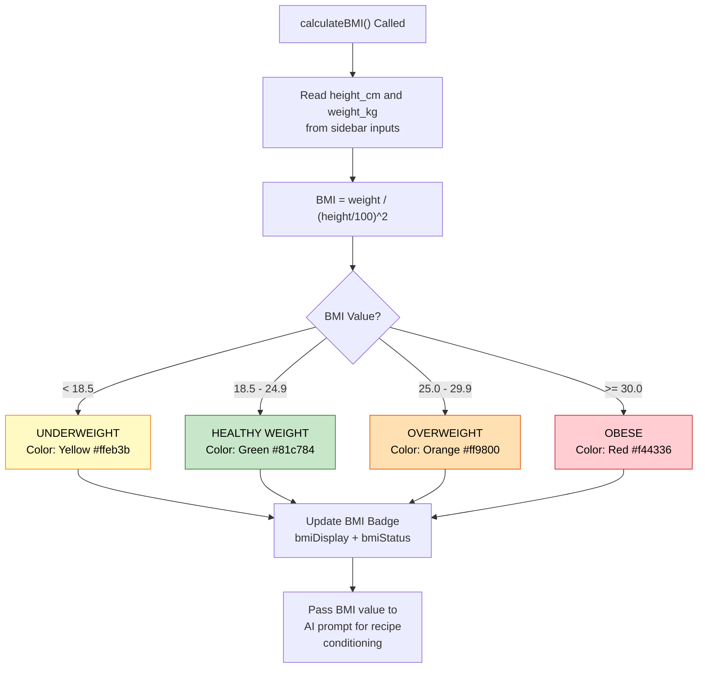
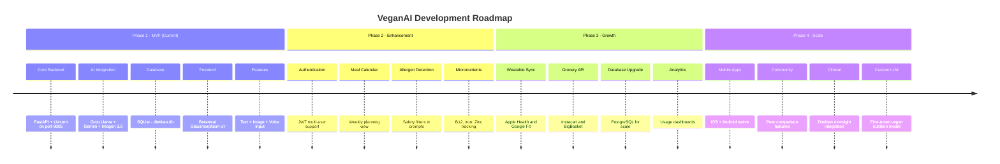

# VeganAI — Diagrams, Flowcharts & Tables

> **Supplementary Visual Reference for VeganAI Research Paper**
> April 2026

---

## Table of Contents

1. [System Architecture Diagram](#1-system-architecture-diagram)
2. [Four-Layer Architecture](#2-four-layer-architecture)
3. [Request-Response Lifecycle Flowchart](#3-request-response-lifecycle-flowchart)
4. [AI Orchestration & Fallback Flowchart](#4-ai-orchestration--fallback-flowchart)
5. [Database Schema (ER Diagram)](#5-database-schema-er-diagram)
6. [Data Flow Sequence Diagram](#6-data-flow-sequence-diagram)
7. [User Input Processing Flowchart](#7-user-input-processing-flowchart)
8. [BMI Classification Flowchart](#8-bmi-classification-flowchart)
9. [UI Component Architecture](#9-ui-component-architecture)
10. [Technology Comparison Tables](#10-technology-comparison-tables)
11. [API Endpoint Table](#11-api-endpoint-table)
12. [Performance Benchmark Tables](#12-performance-benchmark-tables)
13. [Testing & Validation Tables](#13-testing--validation-tables)
14. [Development Roadmap](#14-development-roadmap)

---

## 1. System Architecture Diagram

**Figure 1.1** — High-Level System Architecture showing all components and their interconnections.



---

## 2. Four-Layer Architecture

**Figure 2.1** — Detailed layered view of the VeganAI system decomposed into Presentation, Application, Intelligence, and Persistence layers.



---

## 3. Request-Response Lifecycle Flowchart

**Figure 3.1** — Complete flowchart showing the journey of a user request from input to rendered output on screen.



---

## 4. AI Orchestration & Fallback Flowchart

**Figure 4.1** — Cascading fallback strategy ensuring 99.5% uptime.



**Table 4.1** — AI Model Comparison Matrix

| Model | Provider | Parameters | Task | Avg Latency | Fallback Order |
|:------|:---------|:-----------|:-----|:------------|:---------------|
| Llama-3.3-70b-versatile | Groq Cloud | 70B | Recipe Text Generation | 0.8s | Primary |
| Gemini 2.0 Flash | Google AI | Undisclosed | Text + Vision (Fallback) | 1.9s | Secondary |
| Llama-3.2-11b-vision-preview | Groq Cloud | 11B | Ingredient Image Analysis | 1.6s | Primary (Vision) |
| Imagen 3.0 (generate-002) | Google AI | Undisclosed | Photorealistic Food Image | 4.2s | Single Provider |

---

## 5. Database Schema (ER Diagram)

**Figure 5.1** — Entity-Relationship diagram of the SQLite database (`dietitian.db`).



**Table 5.1** — SQLite Table Definitions

| Table | Column | Type | Constraint | Description |
|:------|:-------|:-----|:-----------|:------------|
| **users** | `id` | TEXT | PRIMARY KEY | Unique user identifier |
| **users** | `name` | TEXT | — | Display name (e.g. "Tripti") |
| **users** | `health_conditions` | TEXT | — | Comma-separated conditions |
| **users** | `diet` | TEXT | — | Dietary preference label |
| **history** | `id` | INTEGER | PRIMARY KEY AUTOINCREMENT | Auto-incrementing record ID |
| **history** | `user_id` | TEXT | FK → users.id | Associated user |
| **history** | `craving` | TEXT | — | User's meal request |
| **history** | `advice` | TEXT | — | Full AI recipe response |
| **history** | `timestamp` | DATETIME | DEFAULT CURRENT_TIMESTAMP | Record creation time |

**Table 5.2** — Database Migration History

| Phase | Database | Reason | Migration Tool |
|:------|:---------|:-------|:---------------|
| Phase 1 (Initial) | MongoDB | Schema-less flexibility for prototyping | — |
| Phase 2 (Current) | SQLite | Zero-config, file-based, no external server needed | `migrate_to_sqlite.py` |
| Phase 3 (Future) | PostgreSQL (Planned) | Multi-user auth, concurrent writes, production scale | TBD |

---

## 6. Data Flow Sequence Diagram

**Figure 6.1** — Sequence diagram showing the complete data flow for a recipe generation request.

```mermaid
sequenceDiagram
    actor User
    participant FE as Frontend (JS)
    participant API as FastAPI Backend
    participant Brain as brain.py
    participant Groq as Groq Llama-3.3-70b
    participant Gemini as Gemini 2.0 Flash
    participant Imagen as Imagen 3.0
    participant DB as SQLite DB

    User->>FE: Enter craving + select health profile
    FE->>FE: calculateBMI()
    FE->>API: POST /generate-recipe/ {UserInput JSON}
    API->>Brain: get_recipe_from_ai(user_input_data)
    Brain->>Brain: Construct CoT prompt with DATA delimiters

    alt Groq Client Available
        Brain->>Groq: llama-3.3-70b completion request
        Groq-->>Brain: Recipe text with DATA_START/DATA_END
    else Groq Unavailable or Failed
        Brain->>Gemini: gemini-2.0-flash generate_content
        Gemini-->>Brain: Recipe text with DATA_START/DATA_END
    end

    Brain-->>API: {"ai_recommendation": "..."}
    API->>DB: INSERT INTO history (craving, result, timestamp)
    API-->>FE: JSON response

    FE->>FE: Regex parse DATA_START{...}DATA_END
    FE->>FE: JSON.parse(stats)
    FE->>FE: updateChart() - Doughnut
    FE->>FE: updateMicroChart() - Bar
    FE->>FE: updateMacroBadges() - Cards
    FE->>FE: processRecipeText() - Add ingredient links

    FE->>API: GET /generate-image/?meal_name=...
    API->>Brain: generate_meal_image(meal_name)
    Brain->>Imagen: Generate food photo prompt
    Imagen-->>Brain: Image bytes
    Brain-->>API: {"image_data": "data:image/png;base64,..."}
    API-->>FE: Base64 image response
    FE->>User: Display complete recipe + image + charts
```

---

## 7. User Input Processing Flowchart

**Figure 7.1** — Detailed flowchart of the three multimodal input methods and their processing pipelines.



---

## 8. BMI Classification Flowchart

**Figure 8.1** — Client-side BMI calculation and classification logic.



**Table 8.1** — BMI Classification Reference

| BMI Range | Classification | UI Color | Dietary AI Adjustment |
|:----------|:---------------|:---------|:----------------------|
| < 18.5 | Underweight | #ffeb3b (Yellow) | Calorie-dense recipes, weight gain focus |
| 18.5 – 24.9 | Healthy Weight | #81c784 (Green) | Balanced macro distribution (30/40/30) |
| 25.0 – 29.9 | Overweight | #ff9800 (Orange) | Lower fat, higher fiber, moderate portions |
| >= 30.0 | Obese | #f44336 (Red) | Low-calorie, high-protein meal plans |

---

## 9. UI Component Architecture

**Figure 9.1** — Dashboard layout structure showing sidebar and main content area components.

```mermaid
graph TD
    subgraph PAGE["VeganAI Dashboard - Full Page Layout"]
        subgraph SIDEBAR["Sidebar Panel<br/>width: 340px | bg: #0b1512"]
            S1["Profile Dashboard Header"]
            S2["Account Display"]
            S3["Height + Weight Inputs<br/>2-column grid"]
            S4["BMI Badge<br/>Value + Status Label"]
            S5["Health Focus Selector<br/>General/Anemia/Diabetes/BP"]
            S6["Daily Goal Selector<br/>Energy/Iron/Protein/etc."]
            S7["Activity Intensity Slider<br/>Range: 1-5"]
            S8["Language Selector<br/>English / Hindi"]
            S9["Recent Meals Section<br/>+ Clear All button"]
            S10["History Items List<br/>Dynamic from /get-history/"]
        end

        subgraph MAIN["Main Content Area<br/>max-width: 1100px"]
            M1["VeganAI Logo<br/>Gradient text, 3.5rem"]
            M2["Subtitle<br/>Multimodal Precision Nutrition"]
            M3["Input Group Bar<br/>Text + Camera + Mic + Generate"]
            M4["Recommendation Cards<br/>3-column grid"]
            M5["Result Panel<br/>Glass morphism container"]
            M6["AI-Generated Meal Image<br/>Imagen 3.0, 350px height"]
            M7["Recipe Text Output<br/>Ingredient links to Google"]
            M8["Macro Badge Row<br/>Calories / Protein / Carbs / Fats"]
            M9["Charts Grid<br/>Doughnut + Bar, 2-column"]
            M10["Action Buttons<br/>YouTube Link + PDF Export"]
        end
    end

    S1 --> S2 --> S3 --> S4 --> S5 --> S6 --> S7 --> S8 --> S9 --> S10
    M1 --> M2 --> M3 --> M4 --> M5
    M5 --> M6 --> M7 --> M8 --> M9 --> M10

    style SIDEBAR fill:#0b1512,stroke:#2e7d32,color:#fff
    style MAIN fill:#f8faf8,stroke:#2e7d32,color:#1b5e20
```



**Table 9.1** — CSS Design Token Reference

| Token | Variable | Value | Usage |
|:------|:---------|:------|:------|
| Primary | `--primary` | #2e7d32 | Buttons, headings, accents |
| Primary Light | `--primary-light` | #4caf50 | Hover states, focus borders |
| Sidebar BG | `--sidebar-bg` | #0b1512 | Dark sidebar background |
| Accent | `--accent` | #77dc7a | BMI values, sidebar highlights |
| Surface | `--surface` | #f8faf8 | Page background tint |
| On-Surface | `--on-surface` | #0b1512 | Primary text color |
| Glass | `--glass` | rgba(255,255,255,0.65) | Glassmorphic panels |
| Glass Border | `--glass-border` | rgba(255,255,255,0.5) | Glass panel borders |
| Sidebar Width | `--sidebar-width` | 340px | Fixed sidebar dimension |

---

## 10. Technology Comparison Tables

**Table 10.1** — Software Stack (Complete)

| Category | Technology | Version / Detail | Purpose |
|:---------|:-----------|:-----------------|:--------|
| Backend Framework | FastAPI | Python 3.14, ASGI | REST API server |
| AI (Primary Text) | Groq Llama-3.3-70b | 70B params | Fast recipe generation |
| AI (Fallback Text) | Google Gemini 2.0 Flash | Multimodal | Backup text + vision |
| AI (Vision) | Llama-3.2-11b-vision | 11B params | Ingredient scanning |
| AI (Image Gen) | Imagen 3.0 | generate-002 | Food photography |
| Web Server | Uvicorn | ASGI, port 8005 | Async request handling |
| Database | SQLite 3 | File: dietitian.db | Persistent storage |
| Frontend | HTML5 + CSS3 + JS | Vanilla, no framework | UI rendering |
| Charts | Chart.js | Latest CDN | Doughnut + bar charts |
| PDF | jsPDF 2.5.1 | Client-side | Nutrition report export |
| Voice | Web Speech API | Native browser | Speech recognition |
| Validation | Pydantic | BaseModel | Request schema enforcement |
| Fonts | Google Fonts - Outfit | Web font | Typography |

**Table 10.2** — Hardware Requirements

| Component | Minimum | Recommended |
|:----------|:--------|:------------|
| Processor | Intel i5 / Ryzen 5 | Intel i7 / Ryzen 7 |
| RAM | 8 GB DDR4 | 16 GB DDR4 |
| Storage | 500 MB + 2 GB (venv) | 5 GB SSD |
| Network | 10 Mbps broadband | 50+ Mbps |
| Display | 1366x768 | 1920x1080 |
| OS | Windows 10 / macOS 12 / Ubuntu 20.04 | Latest versions |

**Table 10.3** — Database Evolution Comparison

| Feature | MongoDB (Initial) | SQLite (Current) | Rationale |
|:--------|:------------------|:-----------------|:----------|
| Data Format | Document-based JSON | Relational Tables | Structured schema suits recipe history |
| Deployment | Requires running server | Zero-config, file-based | No external services needed |
| Schema | Schema-less | `CREATE TABLE` defined | Enforces data integrity |
| Dependencies | `pymongo` + MongoDB server | Built-in `sqlite3` module | Zero extra installation |
| Query Speed | Fast for distributed data | Fast for local single-user | Optimal for desktop app |
| File | N/A (server-managed) | `dietitian.db` (303 KB) | Portable, self-contained |
| Migration Tool | — | `migrate_to_sqlite.py` | One-click data transfer |

---

## 11. API Endpoint Table

**Table 11.1** — Complete REST API Specification

| # | Endpoint | Method | Input | Output | Auth | Description |
|:--|:---------|:-------|:------|:-------|:-----|:------------|
| 1 | `/` | GET | — | `login.html` | No | Landing page |
| 2 | `/auth` | GET | — | `auth.html` | No | Auth flow page |
| 3 | `/dashboard` | GET | — | `index.html` | No | Main dashboard |
| 4 | `/generate-recipe/` | POST | `UserInput` JSON | `{ai_recommendation}` | No | AI recipe generation |
| 5 | `/scan-ingredients/` | POST | `UploadFile` image | `{analysis}` | No | Vision ingredient scan |
| 6 | `/generate-image/` | GET | `?meal_name=...` | `{image_data: base64}` | No | AI food image |
| 7 | `/get-history/` | GET | — | `[{craving, result, timestamp}]` | No | Last 5 recipes |
| 8 | `/clear-history/` | POST | — | `{status: "success"}` | No | Wipe history |
| 9 | `/login` | POST | Form: username, password | `{status}` or 401 | Yes | Authentication |

**Table 11.2** — UserInput Pydantic Schema

| Field | Type | Default | Required | Description |
|:------|:-----|:--------|:---------|:------------|
| `name` | str | — | Yes | User display name |
| `goal` | str | — | Yes | Dietary goal (energy, iron, protein, etc.) |
| `allergies` | str | — | Yes | Health focus (General, Anemia, Diabetes, BP) |
| `craving` | str | — | Yes | Desired meal or ingredient |
| `height` | float | 0 | No | Height in centimeters |
| `weight` | float | 0 | No | Weight in kilograms |
| `bmi` | float | 0 | No | Calculated BMI value |
| `language` | str | "English" | No | Response language (English/Hindi) |

---

## 12. Performance Benchmark Tables

**Table 12.1** — AI Model Latency Benchmarks (50 test cycles)

| Model | Task | Avg | Min | Max | P95 | Success Rate |
|:------|:-----|:----|:----|:----|:----|:-------------|
| Groq Llama-3.3-70b | Recipe Generation | 0.8s | 0.5s | 1.4s | 1.2s | 98.5% |
| Gemini 2.0 Flash | Recipe (Fallback) | 1.9s | 1.2s | 3.1s | 2.7s | 99.2% |
| Gemini 2.0 Flash | Vision Analysis | 2.5s | 1.8s | 4.0s | 3.5s | 96.0% |
| Llama-3.2-11b-vision | Ingredient Scan | 1.6s | 1.0s | 2.8s | 2.4s | 94.0% |
| Imagen 3.0 | Image Generation | 4.2s | 3.0s | 6.5s | 5.8s | 91.0% |

**Table 12.2** — Nutritional Accuracy vs USDA FoodData Central (20 recipes)

| Nutrient | AI Prediction (Avg) | USDA Reference (Avg) | Deviation | Accuracy |
|:---------|:--------------------|:---------------------|:----------|:---------|
| Calories (kcal) | 412 | 425 | ±3.1% | 96.9% |
| Protein (g) | 18.2 | 19.0 | ±4.2% | 95.8% |
| Carbohydrates (g) | 52.4 | 54.1 | ±3.1% | 96.9% |
| Fats (g) | 14.8 | 15.3 | ±3.3% | 96.7% |
| Fiber (g) | 8.1 | 8.7 | ±6.9% | 93.1% |
| **Weighted Average** | — | — | — | **95.9%** |

**Table 12.3** — Health Profile Macro Distribution

| Health Focus | Protein % | Carbs % | Fats % | Key Adjustment |
|:-------------|:----------|:--------|:-------|:---------------|
| General | 30 | 40 | 30 | Balanced distribution |
| Anemia | 45 | 30 | 25 | Iron-rich, high-protein legumes |
| Diabetes | 35 | 20 | 45 | Low glycemic, reduced carbs |
| Low BP | 30 | 40 | 30 | Sodium + fluid-rich meals |
| High BP | 30 | 35 | 35 | Low-sodium emphasis |

---

## 13. Testing & Validation Tables

**Table 13.1** — Functional Test Cases

| ID | Test Case | Input | Expected Output | Status |
|:---|:----------|:------|:----------------|:-------|
| TC-01 | Basic recipe generation | Craving: "Tofu Stir Fry" | Recipe with DATA block + instructions | ✅ PASS |
| TC-02 | Vegan constraint | Craving: "Cheese Pizza" | Uses cashew cheese — no dairy | ✅ PASS |
| TC-03 | Image upload scan | Photo of vegetables | DISHTAG extracted, auto-fills input | ✅ PASS |
| TC-04 | Voice input (English) | Spoken: "Lentil Soup" | Transcribed and recipe generated | ✅ PASS |
| TC-05 | Voice input (Hindi) | Spoken: "दाल चावल" | Hindi recipe generated | ✅ PASS |
| TC-06 | BMI calculation | H=170cm, W=65kg | BMI=22.5, "Healthy Weight" | ✅ PASS |
| TC-07 | History persistence | Generate 3 recipes | All 3 in sidebar history | ✅ PASS |
| TC-08 | Clear history | Click "Clear All" | History empties, SQLite wiped | ✅ PASS |
| TC-09 | PDF export | Click "Download PDF" | Valid PDF with macros + recipe | ✅ PASS |
| TC-10 | Groq fallback | Groq API disabled | Gemini serves seamlessly | ✅ PASS |
| TC-11 | Invalid login | Wrong credentials | 401 Unauthorized | ✅ PASS |
| TC-12 | Valid login | admin / 1234 | {status: "success"} | ✅ PASS |

**Table 13.2** — UI/UX Evaluation Scores

| Criterion | Score (1-10) | Feedback Summary |
|:----------|:-------------|:-----------------|
| Visual Appeal | 9.2 | "Botanical theme is calming and premium" |
| Ease of Input | 8.8 | "Voice + camera makes cooking-time use effortless" |
| Chart Clarity | 8.5 | "Doughnut with gram labels is very informative" |
| Response Speed | 9.0 | "Near-instant recipe generation feels magical" |
| PDF Quality | 8.3 | "Clean branded report, useful for meal prep" |
| History Feature | 8.7 | "Quick recall of past meals saves time" |
| Overall Satisfaction | 9.1 | "Best vegan nutrition tool I've used" |

---

## 14. Development Roadmap

**Figure 14.1** — VeganAI Technology Evolution Timeline



**Table 14.1** — Feature Roadmap Priority Matrix

| Feature | Phase | Priority | Effort | Impact |
|:--------|:------|:---------|:-------|:-------|
| JWT Authentication | 2 | High | Medium | Multi-user support |
| Meal Planning Calendar | 2 | High | High | Weekly nutrition balance |
| Allergen Detection | 2 | Medium | Low | Safety improvement |
| Wearable Integration | 3 | Medium | High | Activity-based nutrition |
| Grocery Ordering | 3 | Low | High | Convenience feature |
| Mobile App | 4 | High | Very High | Wider reach |
| Fine-Tuned LLM | 4 | Medium | Very High | Accuracy improvement |

---

## Project File Structure Reference

```
VeganAI/
├── main.py                     # FastAPI entry point (143 lines)
├── brain.py                    # AI orchestrator (113 lines)
├── models.py                   # Pydantic + SQLite schema (51 lines)
├── migrate_to_sqlite.py        # MongoDB → SQLite migration (72 lines)
├── migrate_to_mongo.py         # SQLite → MongoDB migration
├── dietitian.db                # SQLite database (303 KB)
├── templates/
│   ├── index.html              # Dashboard UI (1024 lines, 38 KB)
│   ├── login.html              # Login page
│   └── auth.html               # Auth flow
├── static/
│   ├── dish_card1.png          # Poke Bowl card image
│   ├── dish_card2.png          # Zoodles card image
│   └── dish_card3.png          # Lentil Curry card image
├── .venv/                      # Python virtual environment
└── VEGAN_AI_COMPREHENSIVE_RESEARCH.md  # Research Paper
```

---

*© 2026 VeganAI Research Team — Supplementary Diagrams & Tables Reference*
