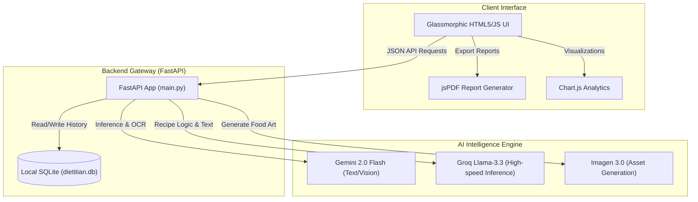

# 🌱 VeganAI — Multimodal Precision Nutrition Assistant

VeganAI is a **Multimodal Precision Nutrition Assistant** and "Digital Dietitian" designed to simplify plant-based living. Powered by state-of-the-art Generative AI models, VeganAI provides personalized, scientifically-backed nutritional insights, computer-vision ingredient analysis, and gourmet recipe generation tailored to specific user health profiles, BMI metrics, and goals.

---

## 🌟 Key Features

*   **Precision Recipe Generation**: Creates gourmet vegan recipes tailored to cravings, health profiles (e.g., Anemia, Diabetes), and weight/BMI metrics, with a comprehensive macro-nutrient breakdown.
*   **AI Vision Ingredient Scanner**: Upload images of raw ingredients to identify them instantly and receive customized dish recommendations (powered by `DISHTAG` technology).
*   **Imagen 3.0 Food Photography**: Automatically generates professional-grade, styled food photography for the suggested recipes in real-time.
*   **Dual AI Engine Integration**: Utilizes Google Gemini 2.0 Flash for multi-modal text and vision processing and Groq (Llama-3.3-70b) for ultra-fast recipe generation.
*   **Smart History Management**: Keeps track of generated recipes, macros, and search history locally using SQLite or MongoDB.
*   **Rich Botanical Design System**: A premium, responsive user interface featuring glassmorphic overlays (`backdrop-filter`), smooth botanical gradients, interactive Chart.js visualizations, and client-side PDF export.

---

## 🏗️ System Architecture

VeganAI uses a decoupled backend orchestrator that bridges the user client interface with modern LLM, Vision, and Image Generation APIs.



---

## 🛠️ Technology Stack

| Component | Technology | Role |
| :--- | :--- | :--- |
| **Backend** | [FastAPI](https://fastapi.tiangolo.com/) | High-performance Python ASGI web framework |
| **Server** | [Uvicorn](https://www.uvicorn.org/) | Production-ready ASGI server |
| **AI Models** | Google Gemini 2.0 Flash & Groq Llama-3.3 | Multimodal reasoning, Ingredient OCR, and Text generation |
| **Image Generation** | Imagen 3.0 | Real-time professional food photography |
| **Database** | SQLite (Default) & MongoDB (Optional) | User configuration and historical recipe logging |
| **Frontend** | HTML5, JavaScript, Vanilla CSS | Premium Glassmorphism UI & micro-animations |
| **Visualizations** | Chart.js | Interactive macro and micro-nutrient charts |
| **Document Export** | jsPDF | On-demand PDF receipt/report generation |

---

## 📁 Project Structure

*   [main.py](file:///c:/Users/tript/OneDrive/Documents/GitHub/VeganAI/main.py): The main FastAPI application gateway containing route definitions, SQLite database setup, and user authentication logic.
*   [brain.py](file:///c:/Users/tript/OneDrive/Documents/GitHub/VeganAI/brain.py): The core AI logic wrapper. Integrates Google GenAI (Gemini/Imagen) and Groq clients, orchestrating recipe and image generation.
*   [models.py](file:///c:/Users/tript/OneDrive/Documents/GitHub/VeganAI/models.py): SQLite table schema definitions and initial user profile seed data.
*   [templates/](file:///c:/Users/tript/OneDrive/Documents/GitHub/VeganAI/templates/):
    *   [login.html](file:///c:/Users/tript/OneDrive/Documents/GitHub/VeganAI/templates/login.html): Beautiful entrance screen with login validation.
    *   [auth.html](file:///c:/Users/tript/OneDrive/Documents/GitHub/VeganAI/templates/auth.html): User registration and settings configuration.
    *   [index.html](file:///c:/Users/tript/OneDrive/Documents/GitHub/VeganAI/templates/index.html): Interactive Main Dashboard featuring scanner, charts, search, and history.
*   [static/](file:///c:/Users/tript/OneDrive/Documents/GitHub/VeganAI/static/): Hosts static UI assets, botanical wallpapers, and mock placeholder images.
*   [migrate_to_mongo.py](file:///c:/Users/tript/OneDrive/Documents/GitHub/VeganAI/migrate_to_mongo.py): Migration script to export SQLite history to MongoDB.
*   [migrate_to_sqlite.py](file:///c:/Users/tript/OneDrive/Documents/GitHub/VeganAI/migrate_to_sqlite.py): Migration script to pull MongoDB history back into SQLite.

---

## ⚙️ Setup and Installation

### Prerequisites

Ensure you have Python 3.10+ installed on your system.

### 1. Clone the Repository
```bash
git clone https://github.com/triptithawait/VeganAI.git
cd VeganAI
```

### 2. Configure a Virtual Environment
```bash
# Create venv
python -m venv venv

# Activate venv (Windows)
.\venv\Scripts\activate

# Activate venv (macOS/Linux)
source venv/bin/activate
```

### 3. Install Dependencies
```bash
pip install -r requirements.txt
```

### 4. Set Up Environment Variables
Create a `.env` file in the root directory. You can copy the template from `.env.example`:
```env
GOOGLE_API_KEY=your_google_gemini_api_key_here
GROQ_API_KEY=your_groq_api_key_here
ADMIN_USERNAME=admin
ADMIN_PASSWORD=1234

# MongoDB Configuration (Optional, for migration tests)
MONGO_URL=mongodb://localhost:27017/
MONGO_DB_NAME=veganai_db
MONGO_COLLECTION_NAME=history
```

### 5. Run the Application
Start the FastAPI server locally:
```bash
python main.py
```
Or run directly via Uvicorn:
```bash
uvicorn main:app --host 127.0.0.1 --port 8005 --reload
```
Once started, open [http://127.0.0.1:8005](http://127.0.0.1:8005) in your web browser.

---

## 🔄 Database Migrations

VeganAI supports dual-database setups for historical record tracking. By default, it operates on a zero-config, file-based SQLite database (`dietitian.db`). However, utilities are provided if you wish to run a local MongoDB instance.

### Migrate from SQLite to MongoDB
Ensure MongoDB is running locally (e.g. `mongodb://localhost:27017/`), then execute:
```bash
python migrate_to_mongo.py
```

### Migrate from MongoDB to SQLite
To synchronize history back into your local SQLite environment:
```bash
python migrate_to_sqlite.py
```

---

## 📄 Companion Research & Documentation

This repository contains academic-level reports and deep-dives detailing the design choices, latency benchmarks, and precision accuracy of VeganAI:
*   [FINAL_RESEARCH_PAPER.md](file:///c:/Users/tript/OneDrive/Documents/GitHub/VeganAI/FINAL_RESEARCH_PAPER.md): Comprehensive academic analysis of plant-based dietary hurdles and multimodal AI effectiveness.
*   [VEGAN_AI_COMPREHENSIVE_RESEARCH.md](file:///c:/Users/tript/OneDrive/Documents/GitHub/VeganAI/VEGAN_AI_COMPREHENSIVE_RESEARCH.md): System architecture deep dive, database evaluation (SQLite vs MongoDB), and model comparison logs.
*   [DIAGRAMS_AND_TABLES.md](file:///c:/Users/tript/OneDrive/Documents/GitHub/VeganAI/DIAGRAMS_AND_TABLES.md): Full breakdown of nutritional comparisons, performance charts, and diagrams.
*   [REPORT.md](file:///c:/Users/tript/OneDrive/Documents/GitHub/VeganAI/REPORT.md): High-level technical overview of recent upgrades and features.

---

## 🛡️ License

This project is licensed under the MIT License - see the LICENSE file for details.
