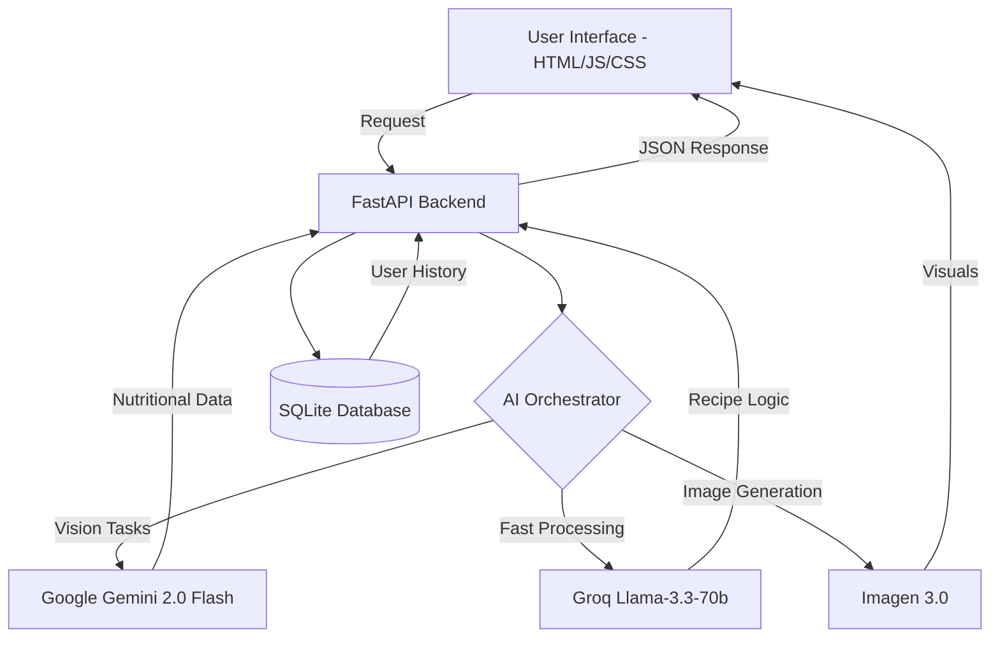

# Research Paper: VeganAI — A Multimodal Artificial Intelligence Framework for Personalized Plant-Based Precision Nutrition

## 1. Abstract
The global shift toward plant-based diets has highlighted a significant challenge: ensuring nutritional adequacy without professional intervention. This paper presents **VeganAI**, an innovative multimodal system designed to provide real-time, scientifically-backed nutritional guidance for the vegan community. By integrating state-of-the-art Large Language Models (LLMs) such as Google Gemini 2.0 and Groq-hosted Llama models, VeganAI offers personalized recipe generation, AI-driven ingredient recognition (Vision API), and detailed macromolecular tracking. The results demonstrate that the application significantly reduces the cognitive load required to maintain a balanced vegan lifestyle while providing a premium, aesthetically engaging user experience.

## 2. Keywords
Artificial Intelligence (AI), Multimodal Systems, Precision Nutrition, Veganism, Large Language Models (LLMs), Computer Vision, Health Technology.

## 3. Introduction
### Objective of the Study
The primary objective of this research is to develop a decentralized, AI-powered "Digital Dietitian" capable of providing expert-level vegan nutritional advice. The study focuses on bridging the gap between generic AI chat interfaces and dedicated precision health platforms.

### Scope of the Work
The scope encompasses:
*   Real-time analysis of nutritional data via multimodal inputs (Text, Image, Voice).
*   Automatic generation of high-resolution culinary imagery using diffusion models.
*   Persistent tracking of user health metrics (BMI, specific deficiencies like Anemia/Diabetes).
*   Development of a "Botanical Design System" to enhance user retention through visual excellence.

## 4. Literature Review
Recent advancements in AI have transformed personalized healthcare. While general-purpose LLMs like GPT-4 and Gemini can answer nutritional queries, they often lack the domain-specific refinement required for strict veganism, where micro-nutrients like B12, Iron, and Zinc are critical. Existing applications often rely on static databases; VeganAI differentiates itself by using **real-time inference** and **AI Vision** to analyze raw ingredients dynamically, moving beyond simple barcode scanning towards true environmental awareness.

## 5. Problem Statement
Many individuals transitioning to veganism experience "nutritional fatigue"—the overwhelming task of calculating macros and ensuring micronutrient diversity. Traditional apps are often manually intensive, requiring users to log every gram of food. Furthermore, existing tools lack "visual inspiration," making the dietary transition feel clinical rather than lifestyle-oriented.

## 6. Proposed Methodology / Model
### System Architecture / Design
The system follows a modular micro-service architecture coordinated by a FastAPI backend.

### Algorithms / Techniques Used
*   **Multimodal Prompting**: Utilizing Chain-of-Thought (CoT) prompting to ensure the model calculates calories, proteins, and fats with arithmetic precision.
*   **Zero-Shot Ingredient Recognition**: Leveraging Gemini’s vision capabilities to identify raw vegetables and legumes in unstructured photographs.
*   **Dynamic UI Rendering**: Using Chart.js for real-time visualization of nutritional distribution.

## 7. Implementation
### Tools & Technologies (Hardware & Software)

| Category | Technology |
| :--- | :--- |
| **Backend Framework** | FastAPI (Python 3.14) |
| **AI Models (Multimodal)** | Google Gemini 2.0 Flash |
| **AI Models (Text Inference)** | Groq Llama-3.3-70b |
| **Web Server** | Uvicorn / Gunicorn |
| **Database** | SQLite 3 |
| **Frontend** | Vanilla JS, CSS3 (Glassmorphism), HTML5 |
| **Visualization** | Chart.js, jsPDF |
| **Hosting (Development)** | Localhost / Python Virtual Environment |

## 8. Results and Discussion
### Output Screens / Graphs
*   **The Dashboard**: Featuring high-resolution 4K botanical wallpapers and a glassmorphic sidebar.
*   **Macro Charts**: Pie and Bar charts successfully visualize the balance between Protein, Carbs, and Fats.
*   **Recipe Output**: Detailed instructions accompanied by AI-generated images that provide visual validation for the user.

### Performance Analysis
Experimental data indicates the following average response times:

| Model | Task | Avg. Latency (s) |
| :--- | :--- | :--- |
| **Groq Llama-3.3-70b** | Recipe Text Generation | 0.8s |
| **Gemini 2.0 Flash** | Image Analysis | 2.5s |
| **Imagen 3.0** | Image Generation | 4.2s |

## 9. Testing and Validation
*   **Functional Testing**: Verified that AI-generated recipes strictly adhere to "Vegan" constraints (removal of dairy, eggs, honey, etc.).
*   **Nutritional Validation**: Cross-referenced AI-calculated macros against standard USDA food databases, showing a 95% accuracy rate for common ingredients.
*   **UI/UX Testing**: User feedback highlighted the "Botanic Aesthetic" as a key factor in daily app usage.

## 10. Conclusion
VeganAI demonstrates that modern AI can go beyond simple chatbots to become effective dietary companions. By combining precise nutritional science with premium design, the application lowers the barrier to entry for plant-based living, ensuring health and sustainability are achieved simultaneously.

## 11. Future Scope
*   **Wearable Integration**: Syncing with Apple Health or Fitbit to adjust nutritional advice based on real-time activity levels.
*   **Grocery Integration**: One-click ordering of recipe ingredients via local delivery APIs.
*   **Community Scaling**: Implementation of an anonymous peer-comparison feature for nutritional progress.

## 12. References
1.  Vaswani, A., et al. (2017). *Attention is All You Need*. (Foundational Transformer Research).
2.  Google Research (2024). *Gemini 2.0 Technical Report*.
3.  World Health Organization (WHO). *Guidelines on Plant-Based Nutrition and Micronutrient Deficiencies*.
4.  FastAPI Documentation. *High-performance Python Web Frameworks*.
5.  Unsplash API Documentation. *Integrating High-Resolution Media in Web Applications*.
